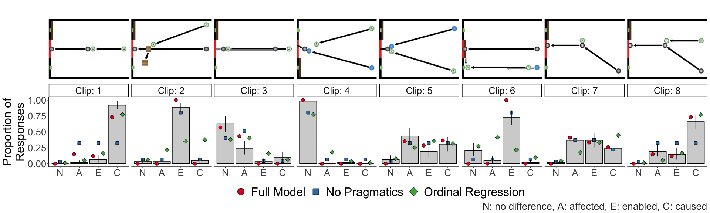
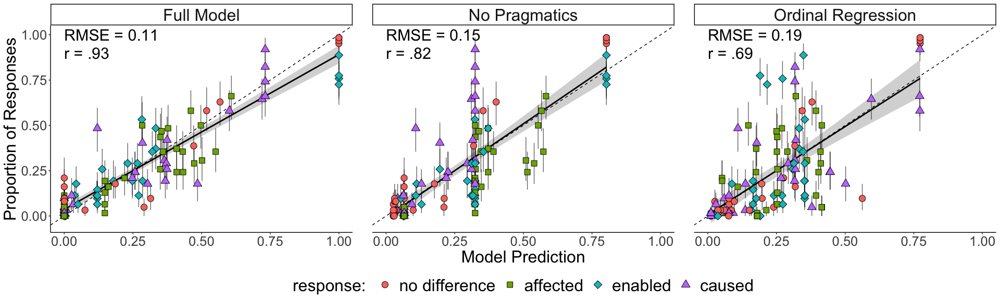

Causal Language Analysis
================
Erin Bennett, Ari Beller, Tobias Gerstenberg

  - [Load packages](#load-packages)
  - [Read in data](#read-in-data)
      - [Participants](#participants)
      - [Get participant responses](#get-participant-responses)
  - [Model](#model)
      - [Full Model and Lesion RSA](#full-model-and-lesion-rsa)
          - [Model Statistics](#model-statistics)
          - [Cross-Validation](#cross-validation)
      - [Bayesian Regression](#bayesian-regression)
          - [Model Statistics](#model-statistics-1)
          - [Cross-Validation](#cross-validation-1)
      - [Enable Comparison](#enable-comparison)
  - [Plots](#plots)
      - [Tables](#tables)

# Load packages

``` r
library("RSQLite")
library("lubridate")
library("rjson")
library("tidyjson")
library("jpeg")
library("egg") # for geom_custom()
library("grid")
library("brms")
library("Metrics")
library("knitr")
library("tidyverse")
```

``` r
opts_chunk$set(comment = "#>",
               fig.show = "hold")

theme_set(theme_classic() + 
            theme(text = element_text(size = 24)))

options(dplyr.summarise.inform = F)
```

# Read in data

Data is stored in
`causal_language_public/data/full_database_anonymized.db`.

``` r
con = dbConnect(SQLite(), dbname = "../../data/full_database_anonymized.db");
df_data = dbReadTable(con, "language")
dbDisconnect(con)
```

``` r
# filter out incompletes 
df_data = df_data %>%
  filter(status %in% 3:5,
         !str_detect(mode, "debug"),
         codeversion %in% c("forced_choice_2"))
```

## Participants

``` r
df_demographics = df_data$datastring %>% 
  spread_values(language = jstring("questiondata", "language"),
                age = jstring("questiondata", "age"),
                gender = jstring("questiondata", "gender"),
                race = jstring("questiondata", "race"),
                ethnicity = jstring("questiondata", "ethnicity"),
                feedback = jstring("questiondata", "feedback")) %>% 
  rename(participant = document.id) %>% 
  mutate(time = difftime(df_data$endhit,
                         df_data$beginhit,
                         units = "mins"))
```

Age:

``` r
df_demographics %>%
  mutate(age = as.numeric(age)) %>%
  summarise(`Median age` = median(age, na.rm = TRUE),
            `Age standard deviation` = sd(age, na.rm = TRUE)) %>%
  kable()
```

| Median age | Age standard deviation |
| ---------: | ---------------------: |
|         34 |               8.241211 |

Gender:

``` r
df_demographics %>%
  mutate(gender = str_replace(gender, "^[fF].*", "Female"),
         gender = str_replace(gender, "^[mM].*", "Male"),
         gender = str_replace(gender, "^$", NA_character_)) %>%
  count(gender, name = "Count") %>%
  mutate(gender = recode(gender, .missing = "No response")) %>%
  kable()
```

| gender      | Count |
| :---------- | ----: |
| Female      |    19 |
| Male        |    43 |
| No response |     2 |

Language:

``` r
df_demographics %>%
  mutate(language = str_replace(language, "^[eE][nN][gG].*", "English"),
         language = str_replace(language, "^$", NA_character_)) %>%
  count(language, name = "Count") %>%
  mutate(language = recode(language, .missing = "No response")) %>%
  kable()
```

| language | Count |
| :------- | ----: |
| English  |    63 |
| Italian  |     1 |

How long did it take participants to do the task?

``` r
df_demographics %>%
  summarise(`Average time spent on task` = mean(time, na.rm = TRUE)) %>%
  kable()
```

| Average time spent on task |
| :------------------------- |
| 25.33679 mins              |

## Get participant responses

``` r
df_long = df_data$datastring %>% 
  as.tbl_json() %>% 
  enter_object("data") %>%
  gather_array("order") %>% 
  enter_object("trialdata") %>% 
  gather_object("index") %>% 
  append_values_string("value") %>% 
  as_tibble() %>% 
  rename(participant = document.id) %>% 
  spread(index, value) %>% 
  rename(trial = id) %>% 
  mutate_at(vars(trial, time), ~ as.numeric(.)) %>% 
  mutate(time = time / 1000) %>% 
  select(participant, trial, description, response, time) %>% 
  arrange(participant, trial)
```

``` r
df_long = df_long %>%
  mutate(is_attention_check = trial == 30)

excluded_participants = df_long %>%
  filter(response != "no_difference" & is_attention_check) %>%
  .$participant

df_long_filtered = df_long %>%
  filter(!(participant %in% excluded_participants))

df_long = df_long %>%
  mutate(is_excluded_participant = participant %in% excluded_participants)

num_excluded_participants = length(excluded_participants)
```

``` r
df_long = df_long %>% filter(!is_excluded_participant)
```

We excluded 2 participants for failing to pass an attention check.

Aggregate participant judgements.

``` r
df_agg = df_long %>%
  # ignore attention check and instruction video
  filter(trial != 30,
         trial != 31,
         !is_excluded_participant) %>% 
  # aggregate over participants
  group_by(trial, response) %>%
  summarise(count = length(response)) %>%   
  ungroup()

df_agg = right_join(
  df_agg,
  expand(df_agg, trial, response),
  by = c("trial", "response")) %>%
  group_by(trial) %>%
  ungroup() %>%
  mutate(count = ifelse(is.na(count), 0, count))

df_agg = df_agg %>%
  group_by(trial) %>%
  mutate(data_y = count / sum(count)) %>%
  ungroup() %>%
  select(trial, response, data_y) %>%
  mutate(trial = as.integer(trial),
         response = factor(response,
                           levels = c("no_difference",
                                      "affect",
                                      "enable",
                                      "cause")))
```

# Model

## Full Model and Lesion RSA

### Model Statistics

Load Model

``` r
df_model = read.csv("../python/useful_csvs/top_models.csv") %>% 
  select(-X) %>% 
  mutate(response = factor(response,
                           levels = c("no_difference",
                                      "affect",
                                      "enable",
                                      "cause")),
         caused_version = ifelse(caused_version == "and_hm_or_ws",
                                 "normal",
                                 "cc"),
         lesion_rsa = ifelse(lesion_rsa,
                             "lesion",
                             "full"))
```

Reported models are cc full (combined cause with pragmatics) and normal
lesion (no combined cause without pragmatics)

``` r
df_model_v_data = df_model %>% 
  left_join(df_agg, by = c("trial", "response")) %>% 
  group_by(caused_version, lesion_rsa) %>% 
  summarise(r = cor(data_y, model_y),
            RMSE = rmse(data_y, model_y)) %>% 
  ungroup()

df_model_v_data %>%
  mutate_if(is.numeric, round, 2)
```

    #> # A tibble: 4 x 4
    #>   caused_version lesion_rsa     r  RMSE
    #>   <chr>          <chr>      <dbl> <dbl>
    #> 1 cc             full        0.93  0.11
    #> 2 cc             lesion      0.8   0.16
    #> 3 normal         full        0.88  0.13
    #> 4 normal         lesion      0.82  0.15

### Cross-Validation

``` r
crossv_full = read.csv("../python/useful_csvs/cross_validation_full_model.csv") %>% 
  select(-X)

crossv_lesion = read.csv("../python/useful_csvs/cross_validation_lesion_model.csv") %>% 
  select(-X)

df_split_models = rbind(crossv_full, crossv_lesion) %>% 
  mutate(lesion_rsa = ifelse(lesion_rsa, "lesion", "full"))

df_split_performance = df_split_models %>% 
  group_by(lesion_rsa, split, use) %>% 
  summarise(r = cor(data_val, model_pred),
            RMSE = rmse(data_val, model_pred)) %>% 
  ungroup()

df_crossval_summary = df_split_performance %>% 
  filter(use == "test") %>% 
  group_by(lesion_rsa) %>% 
  summarise(med = median(r),
            perc_5 = sort(r)[[5]],
            perc_95 = sort(r, decreasing = TRUE)[[5]]) %>% 
  mutate_if(is.numeric, round, 2)

df_crossval_summary
```

    #> # A tibble: 2 x 4
    #>   lesion_rsa   med perc_5 perc_95
    #>   <chr>      <dbl>  <dbl>   <dbl>
    #> 1 full        0.91   0.83    0.94
    #> 2 lesion      0.82   0.73    0.9

## Bayesian Regression

### Model Statistics

Code to train regression. Re-training the regressions from scratch takes
a fair bit of time. So training is commented out. Remove comments to
retrain. Currently Models are saved in regression subfolder. brm will
reload the models rather than retrain (given the same file names). Move
them to retrain models.

``` r
unoise_range = c(0.5, 0.6, 0.7, 0.8, 0.9, 1.0, 1.1, 1.2, 1.3, 1.4, 1.5, 1.6)


df_aspects = read.csv("../python/useful_csvs/aspect_dataframe.csv") %>%
  select(-X)

df_full_data = df_long %>% 
  select(participant, trial, response)


# for (unoise in unoise_range) {
# 
#   df_aspects_given_noise = df_aspects %>%
#     filter(uncertainty_noise == unoise)
# 
#   df_aspects_data = left_join(df_aspects_given_noise,
#                               df_full_data,
#                               by = c("trial")) %>% 
#     mutate(response = factor(response,
#                              levels = c("no_difference",
#                                         "affect",
#                                         "enable",
#                                         "cause"),
#                              ordered = TRUE))
#   
#   if (unoise == 1) {
#     unoise = "1.0"
#   }
#     
#   filename = paste("regression/random_intercepts_noise_", unoise,
#                    sep = "")
#   
#   brm(formula = response ~ whether + how + sufficient + moving + (1 | participant),
#       data = df_aspects_data,
#       family = "cumulative",
#       file = filename,
#       seed = 1)
#   
# }
```

Write aspect-response dataframes to file for later use. Will be helpful
to avoid recomputation in cross-validation.

``` r
for (unoise in unoise_range) {
  df_aspects_given_noise = df_aspects %>% 
    filter(uncertainty_noise == unoise)
  
  
  df_aspects_data = left_join(df_aspects_given_noise,
                              df_full_data,
                              by = c("trial")) %>%
    mutate(response = factor(response,
                             levels = c("no_difference",
                                        "affect",
                                        "enable",
                                        "cause"),
                             ordered = TRUE))
  
  filename = paste("aspect_matched_data/noise_",
                   ifelse(unoise == 1, "1.0", unoise),
                   ".csv",
                   sep = "")
  
  write.csv(df_aspects_data, file = filename)
  
}
```

Produce model predictions

``` r
unoise_range = c(0.5, 0.6, 0.7, 0.8, 0.9, 1.0, 1.1, 1.2, 1.3, 1.4, 1.5, 1.6)


df_aspects = read.csv("../python/useful_csvs/aspect_dataframe.csv") %>%
  select(-X)

reg_list = list()

i = 1
for (unoise in unoise_range) {
  # Choose noise appropriate aspects
  df_aspects_given_noise = df_aspects %>%
    filter(uncertainty_noise == unoise)

  filename = paste("regression/random_intercepts_noise_",
                   ifelse(unoise == 1, "1.0", unoise),
                   ".rds",
                   sep = "")

  # Load regression
  reg = readRDS(filename)

  set.seed(1)

  # Predict and wrangle regression responses
  df_reg_pred = as.data.frame(fitted(reg,
                                    newdata = df_aspects_given_noise,
                                    re_formula = NA)[1:30,1,]) %>% 
    rename(no_difference = 1,
           affect = 2,
           enable = 3,
           cause = 4) %>% 
    mutate(noise = unoise,
           trial = seq(0,29)) %>% 
    pivot_longer(-c("trial", "noise"),
                 names_to = "response",
                 values_to = "model_y")
  
  reg_list[[i]] = df_reg_pred
  i = i + 1
}

# Put predictions from all noise values together
df_reg_pred = bind_rows(reg_list) %>% 
  mutate(response = factor(response,
                           levels = c("no_difference",
                                      "affect",
                                      "enable",
                                      "cause")))
```

Choose best regression model and produce summary statistics

``` r
# Compute squared error with aggregated data scores
df_reg_vs_data = df_reg_pred %>%
  left_join(df_agg, by = c("trial", "response")) %>% 
  mutate(sq_err = (model_y - data_y)^2)

# Compute sum square error for each noise value
df_noise_sum = df_reg_vs_data %>% 
  group_by(noise) %>% 
  summarise(sum_sq_err = sum(sq_err))

# Find the best noise value
best_noise = df_noise_sum[df_noise_sum$sum_sq_err == min(df_noise_sum$sum_sq_err),]$noise[[1]]

# Select the model predictions with best noise value
df_best_reg = df_reg_vs_data %>% 
  filter(noise == best_noise)

# Produce summary statistics
reg_summary = df_best_reg %>% 
  summarise(r = cor(data_y, model_y), RMSE = rmse(data_y, model_y)) %>%
  mutate_if(is.numeric, round, 2)

reg_summary
```

    #> # A tibble: 1 x 2
    #>       r  RMSE
    #>   <dbl> <dbl>
    #> 1  0.69  0.19

### Cross-Validation

For cross validation of the Bayesian ordinal regression models, we
trained ordinal regressions for each noise value on each split. We took
the best performing model for each split (assessed on the held out set),
and saved the predictions of that model to file in the given split
folder. The code for this process is in the crossv\_ordreg.R script. We
ran the code on Stanford’s high-performance computing cluster Sherlock.
It takes considerable computing resources to retrain the models from
scratch, so we provide the pre-computed best performing models in the
splits folder for convenience.

If you would like to reproduce the training, you can run the script from
the command line with the following command:

`Rscript crossv_ordreg.R split_num`

where split\_num is an integer from 1-100 designating the split to run
and assess.

In order to save time in cross validation, we ran the ordinal
regressions in cross validation without random intercepts for
participants.

Load top models and compute summary statistics

``` r
model_list = list()

# Load best models
for (i in seq(1,100)) {
  filename = str_c("splits/split",
                   str_pad(i, 3, side = "left", pad = "0"),
                   "_bestmodel.csv")
  
  mod = read.csv(filename) %>% 
    mutate(split = i)
  
  model_list[[i]] = mod
}

# Filter to just test set
df_crossv_mod = bind_rows(model_list) %>% 
  select(-X) %>% 
  filter(half == "test")

# Compute correlation scores
df_crossv_reg_split_performance = df_crossv_mod %>% 
  group_by(split) %>% 
  summarise(r = cor(model_y, data_y)) %>% 
  ungroup()

# Determine median, 5% and 95%
df_crossv_reg_sum_stat = df_crossv_reg_split_performance %>% 
  summarise(med_r = median(r),
            perc_5 = sort(r)[5],
            perc_95 = sort(r, decreasing = TRUE)[5]) %>% 
  mutate_if(is.numeric, round, 2)

df_crossv_reg_sum_stat
```

    #> # A tibble: 1 x 3
    #>   med_r perc_5 perc_95
    #>   <dbl>  <dbl>   <dbl>
    #> 1  0.59    0.3    0.74

## Enable Comparison

Code to compare enable semantics defined in paper to enable semantics
that explicitly includes negated how causation. We report full model not
how semantics in the paper as the lesion version does worse.

``` r
df_enable_comparison = read.csv("../python/useful_csvs/enable_comparison.csv") %>% 
  select(-X) %>% 
  mutate(response = factor(response,
                           levels = c("no_difference",
                                      "affect",
                                      "enable",
                                      "cause")),
         lesion_rsa = ifelse(lesion_rsa, "lesion", "full"),
         enabled_version = ifelse(enabled_version == "or_ws",
                                  "normal",
                                  "not how")) %>% 
  left_join(df_agg, by = c("trial", "response"))

df_enable_sum = df_enable_comparison %>% 
  group_by(lesion_rsa, enabled_version) %>% 
  summarise(r = cor(model_y, data_y), RMSE = rmse(model_y, data_y)) %>%
  ungroup() %>% 
  mutate_if(is.numeric, round, 2)

df_enable_sum
```

    #> # A tibble: 4 x 4
    #>   lesion_rsa enabled_version     r  RMSE
    #>   <chr>      <chr>           <dbl> <dbl>
    #> 1 full       normal           0.93  0.11
    #> 2 full       not how          0.87  0.16
    #> 3 lesion     normal           0.82  0.15
    #> 4 lesion     not how          0.77  0.17

# Plots

Collect Top Models

``` r
df_full = df_model %>% 
  filter(caused_version == "cc",
         lesion_rsa == "full") %>% 
  mutate(model_label_short = "Full Model") %>% 
  select(trial, response, model_y, model_label_short)

df_no_prag = df_model %>%
  filter(caused_version == "normal",
         lesion_rsa == "lesion") %>% 
  mutate(model_label_short = "No Pragmatics") %>% 
  select(trial, response, model_y, model_label_short)


df_ord_reg = df_best_reg %>% 
  mutate(model_label_short = "Ordinal Regression") %>% 
  select(trial, response, model_y, model_label_short)


best_models_all = rbind(df_full, df_no_prag, df_ord_reg)
```

Add confidence intervals to datapoints.

``` r
count_with_ci = function(df, var) {
  y = df %>%
    group_by(trial, description) %>%
    count({{var}}, name = y, .drop = FALSE)
  resampled_counts =
    map_dfr(1:100,
            function(i) {
              df %>%
                mutate(response = sample({{var}}, replace = TRUE)) %>%
                count(response, .drop = FALSE)
            }) %>%
    group_by(trial, description, response) %>%
    summarise(ymin = quantile(n, probs = 0.025),
              ymax = quantile(n, probs = 0.975))
}

df_actual =
  df_long %>%
  mutate(response = factor(response,
                           levels = c("no_difference",
                                      "affect",
                                      "enable",
                                      "cause"))) %>% 
  filter(trial != 30)

df_agg = map_dfr(1:1000,
                 function(i) {
                   df_actual %>%
                     group_by(trial) %>%
                     mutate(response = sample(response, replace = TRUE)) %>%
                     count(response, .drop = FALSE) %>%
                     mutate(n = n / sum(n))}) %>%
  group_by(trial, response) %>%
  summarise(data_ymin = quantile(n, probs = 0.025),
            data_ymax = quantile(n, probs = 0.975)) %>%
  left_join(df_actual %>%
              group_by(trial) %>%
              count(response, name = "data_y", .drop = FALSE) %>%
              mutate(data_y = data_y / sum(data_y)),
            by = c("trial", "response")) %>%
  ungroup()
```

Code for sample cases graphics

``` r
sample_cases = c(12, 18, 2, 22, 6, 7, 14, 15)
words = c("no_difference", "affect", "enable", "cause")
labels = c("N", "A", "E", "C")
df.plot = df_agg %>%
  filter(trial %in% sample_cases) %>%
  mutate(trial = factor(trial, levels = sample_cases),
         Clip = factor(trial, labels = 1:length(sample_cases)),
         response = factor(response,
                           levels = words,
                           labels = labels))
df.model = best_models_all %>% 
  filter(trial %in% sample_cases) %>%
  mutate(Model = model_label_short,
         trial = factor(trial, levels = sample_cases),
         Clip = factor(trial, labels = 1:length(sample_cases)),
         response = factor(response,
                           levels = words,
                           labels = labels))
func_load_image = function(clip){
  readJPEG(str_c("../../figures/trial_schematics/trial", clip, ".jpeg"))
}
df.clips = df.plot %>% 
  distinct(trial, Clip) %>% 
  arrange(Clip) %>% 
  mutate(grob = map(.x = trial, .f = ~ func_load_image(clip = .x)))
p = ggplot(data = df.plot,
           mapping = aes(x = response, y = data_y)) +
  geom_bar(stat = "identity",
           fill = "lightgray",
           color = "black") +
  geom_point(data = df.model,
             mapping = aes(x = response,
                           y = model_y,
                           shape = Model,
                           fill = Model),
             size = 3,
             position = position_dodge(0.8),
             color = "black") +
  geom_errorbar(
    mapping = aes(ymin = data_ymin, ymax = data_ymax),
    width = 0
  ) +
  geom_custom(data = df.clips,
              mapping = aes(data = grob, x = 2.5, y = Inf),
              grob_fun = function(x) rasterGrob(x,
                                                interpolate = T,
                                                vjust = -0.3)) +
  facet_wrap(~Clip,
             ncol = length(sample_cases),
             labeller = "label_both") +
  scale_fill_brewer(type = "qual", palette = 6, name = "") +
  scale_shape_manual(name = "",
                     values = 21:23) + 
  labs(y = "Proportion of\nResponses",
       caption = "N: no difference, A: affected, E: enabled, C: caused") +
  coord_cartesian(clip = "off") + 
  theme(legend.text.align = 0,
        panel.grid = element_blank(),
        legend.position = "bottom",
        axis.title.x = element_blank(),
        legend.text = element_text(size = 24),
        plot.caption = element_text(size = 20, color = "gray20"),
        plot.margin = margin(t = 6, l = 0.2, r = 0.2, b = 0.1, unit = "cm")) +
  guides(fill = guide_legend(override.aes = list(size = 6)))
p

ggsave("../../figures/paper_plots/cogsci_bar_model_cases.pdf",
       width = 20,
       height = 6)
```

<!-- -->

Code for scatter plot.

``` r
best_models_all = left_join(best_models_all, df_agg, by = c("trial", "response"))

df.plot = best_models_all %>%
  rename(Model = model_label_short) %>% 
  mutate(response = factor(response,
                           levels = c("no_difference", "affect", "enable", "cause"),
                           labels = c("no difference", "affected", "enabled", "caused")))

df.text = df.plot %>% 
  group_by(Model) %>% 
  summarize(r = cor(data_y, model_y),
            RMSE = sqrt(mean((data_y - model_y)^2))) %>% 
  ungroup() %>% 
  pivot_longer(cols = -Model) %>% 
  mutate_if(is.numeric, ~ round(., 2)) %>% 
  mutate(data_y = rep(c(0.9, 1), 3),
         model_y = 0,
         label = str_c(name, " = ", value),
         label = ifelse(name == "r", 
                        str_replace(label, "0.", "."),
                        label))

ggplot(data = df.plot,
       mapping = aes(x = model_y,
                     y = data_y)) +
  geom_smooth(method = "lm",
              se = T,
              color = "black",
              show.legend = F) +
  geom_abline(slope = 1,
              intercept = 0,
              linetype = 2) +
  geom_text(data = df.text,
            mapping = aes(label = label),
            hjust = 0,
            size = 8) + 
  geom_errorbar(mapping = aes(ymin = data_ymin,
                              ymax = data_ymax),
                alpha = 0.6,
                width = 0,
                show.legend = FALSE) +
  geom_point(mapping = aes(fill = response,
                           shape = response),
             alpha = 1.0,
             size = 4) +
  facet_grid(cols = vars(Model)) +
  scale_shape_manual(values = 21:24) + 
  labs(x = "Model Prediction",
       y = "Proportion of Responses") +
  theme(legend.position = "bottom",
        panel.spacing.x = unit(1, "cm"),
        legend.text = element_text(size = 24),
        strip.text = element_text(size = 24)) +
  guides(fill = guide_legend(title = "response: "),
         shape = guide_legend(title = "response: "))
```

    #> `geom_smooth()` using formula 'y ~ x'

``` r
ggsave("../../figures/paper_plots/cogsci_scatter.pdf",
       width = 20,
       height = 6)
```

    #> `geom_smooth()` using formula 'y ~ x'

<!-- -->

### Tables

Automatically generate example tables for walking through RSA model.

Aspects:

``` r
df_sample_aspects = df_aspects %>% 
  filter(uncertainty_noise == 1.0)

sample_cases_aspects = df_sample_aspects %>%
  filter(trial %in% sample_cases[1:4]) %>%
  mutate(trial = factor(trial, levels = sample_cases[1:4])) %>%
  group_by(trial, how, whether, sufficient) %>%
  summarise() %>%
  ungroup() %>%
  mutate(clip = 1L:n()) %>% 
  select(trial, clip, whether, how, sufficient)

sample_cases_aspects %>%
  kable()
```

| trial | clip | whether | how | sufficient |
| :---- | ---: | ------: | --: | ---------: |
| 12    |    1 |       1 |   1 |          1 |
| 18    |    2 |       1 |   0 |          1 |
| 2     |    3 |       0 |   1 |          0 |
| 22    |    4 |       0 |   0 |          0 |

Semantics:

``` r
how_param = 0.2
sample_cases_semantics = sample_cases_aspects %>%
  transmute(trial,
            clip,
            enable = whether + sufficient - whether*sufficient,
            cause = how*(enable),
            affect = how,
            whether_or_suff = enable,
            how_and_flip = how * how_param,
            something_true_how_soft = whether_or_suff + how_and_flip - whether_or_suff*how_and_flip,
            no_diff = 1 - (something_true_how_soft)) %>%
  select(trial, clip, cause, enable, affect, no_diff)

sample_cases_semantics %>%
  kable()
```

| trial | clip | cause | enable | affect | no\_diff |
| :---- | ---: | ----: | -----: | -----: | -------: |
| 12    |    1 |     1 |      1 |      1 |      0.0 |
| 18    |    2 |     0 |      1 |      0 |      0.0 |
| 2     |    3 |     0 |      0 |      1 |      0.8 |
| 22    |    4 |     0 |      0 |      0 |      1.0 |

Literal listener:

``` r
sample_cases_l0 = sample_cases_semantics %>%
  mutate_at(vars(cause, enable, affect, no_diff), ~ . / sum(.))

sample_cases_l0 %>%
  kable()
```

| trial | clip | cause | enable | affect |  no\_diff |
| :---- | ---: | ----: | -----: | -----: | --------: |
| 12    |    1 |     1 |    0.5 |    0.5 | 0.0000000 |
| 18    |    2 |     0 |    0.5 |    0.0 | 0.0000000 |
| 2     |    3 |     0 |    0.0 |    0.5 | 0.4444444 |
| 22    |    4 |     0 |    0.0 |    0.0 | 0.5555556 |

Speaker:

``` r
sample_cases_s1 = sample_cases_l0 %>%
  mutate(z = cause + enable + affect + no_diff,
         cause = cause / z,
         enable = enable / z,
         affect = affect / z,
         no_diff = no_diff / z)

sample_cases_s1 %>%
  select(-z) %>%
  kable()
```

| trial | clip | cause | enable |    affect |  no\_diff |
| :---- | ---: | ----: | -----: | --------: | --------: |
| 12    |    1 |   0.5 |   0.25 | 0.2500000 | 0.0000000 |
| 18    |    2 |   0.0 |   1.00 | 0.0000000 | 0.0000000 |
| 2     |    3 |   0.0 |   0.00 | 0.5294118 | 0.4705882 |
| 22    |    4 |   0.0 |   0.00 | 0.0000000 | 1.0000000 |
