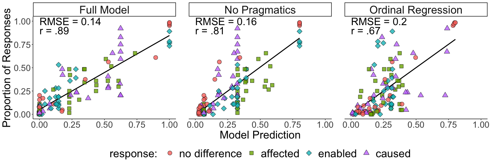

Causal Language Forced-Choice Experiment Analysis
================
Erin Bennett and Ari Beller

# (Install) and load packages

If necessary, uncomment the following lines and run this code block to
install packages:

``` r
# Uncomment the following lines to install required packages
# install.packages("tidyverse")
# install.packages("RSQLite")
# install.packages("lubridate")
# install.packages("rjson")
# install.packages("tidyjson")
# install.packages("jpeg")
# install.packages("egg") # for geom_custom()
# install.packages("grid")
# install.packages("brms")
```

To render all output file formats, knit the file by running:

    rmarkdown::render('forced_choice_expt_analysis.Rmd', output_format = 'all')

# Read in data

Data is stored in
`causal_language_public/data/full_database_anonymized.db`.

## Participants

Age:

| Median age | Age standard deviation |
| ---------: | ---------------------: |
|         34 |               8.256416 |

Gender:

| gender      | Count |
| :---------- | ----: |
| Female      |    19 |
| Male        |    44 |
| No response |     3 |

Language:

| language    | Count |
| :---------- | ----: |
| English     |    64 |
| Italian     |     1 |
| No response |     1 |

How long did it take participants to do the task?

| Average time spent on task |
| :------------------------- |
| 25.00133 mins              |

## Get participant responses

We excluded 2 participants for failing to pass an attention check.

# Model

The RSA model results are in
`causal_language_public/python/forced_choice_expt_rsa.csv`. This file is
produced by running
`causal_language_public/python/forced_choice_expt_rsa.py`.

## Bayesian Ordinal Regression

Regression results are in the directory
`causal_language_public/regression/`.

# Best Models

## With movement feature

| model\_label\_short |         R |      RMSE |
| :------------------ | --------: | --------: |
| Full Model          | 0.8854853 | 0.1376269 |
| No Pragmatics       | 0.8098447 | 0.1560154 |
| Ordinal Regression  | 0.6683447 | 0.1976832 |

### Plots

<!-- -->

    `geom_smooth()` using formula 'y ~ x'
    `geom_smooth()` using formula 'y ~ x'

<!-- -->

### Tables

Automatically generate example tables for walking through RSA model.

Aspects:

| trial | whether | how | sufficient | clip |
| :---: | ------: | --: | ---------: | ---: |
|  12   |       1 |   1 |          1 |    1 |
|  18   |       1 |   0 |          1 |    2 |
|   2   |       0 |   1 |          0 |    3 |
|  22   |       0 |   0 |          0 |    4 |

Semantics:

| trial | cause | enable | affect | no\_diff |
| :---: | ----: | -----: | -----: | -------: |
|  12   |     1 |      1 |      1 |      0.0 |
|  18   |     0 |      1 |      0 |      0.0 |
|   2   |     0 |      0 |      1 |      0.8 |
|  22   |     0 |      0 |      0 |      1.0 |

Literal listener:

| trial | cause | enable | affect |  no\_diff |
| :---: | ----: | -----: | -----: | --------: |
|  12   |     1 |    0.5 |    0.5 | 0.0000000 |
|  18   |     0 |    0.5 |    0.0 | 0.0000000 |
|   2   |     0 |    0.0 |    0.5 | 0.4444444 |
|  22   |     0 |    0.0 |    0.0 | 0.5555556 |

Speaker:

| trial | cause | enable |    affect |  no\_diff |
| :---: | ----: | -----: | --------: | --------: |
|  12   |   0.5 |   0.25 | 0.2500000 | 0.0000000 |
|  18   |   0.0 |   1.00 | 0.0000000 | 0.0000000 |
|   2   |   0.0 |   0.00 | 0.5294118 | 0.4705882 |
|  22   |   0.0 |   0.00 | 0.0000000 | 1.0000000 |

## Without movement feature

| model\_label\_short |         R |      RMSE |
| :------------------ | --------: | --------: |
| Full Model          | 0.8629673 | 0.1475821 |
| No Pragmatics       | 0.8063111 | 0.1573542 |
| Ordinal Regression  | 0.6258472 | 0.2072770 |
