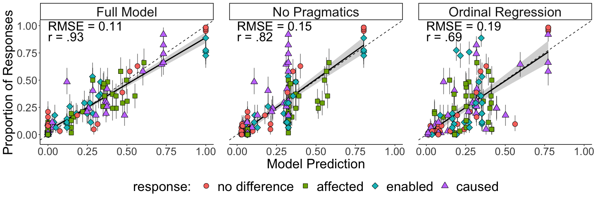

Causal Language Forced-Choice Experiment Analysis
================
Erin Bennett and Ari Beller

(Install) and load packages
===========================

If necessary, uncomment the following lines and run this code block to install packages:

``` r
# Uncomment the following lines to install required packages
# install.packages("tidyverse")
# install.packages("RSQLite")
# install.packages("lubridate")
# install.packages("rjson")
# install.packages("tidyjson")
# install.packages("jpeg")
# install.packages("egg") # for geom_custom()
# install.packages("grid")
# install.packages("brms")
# install.packages("Metrics")
```

To render all output file formats, knit the file by running:

    rmarkdown::render('forced_choice_expt_analysis.Rmd', output_format = 'all')

Read in data
============

Data is stored in `causal_language_public/data/full_database_anonymized.db`.

Participants
------------

Age:

|  Median age|  Age standard deviation|
|-----------:|-----------------------:|
|          34|                8.241211|

Gender:

| gender      |  Count|
|:------------|------:|
| Female      |     19|
| Male        |     43|
| No response |      2|

Language:

| language |  Count|
|:---------|------:|
| English  |     63|
| Italian  |      1|

How long did it take participants to do the task?

| Average time spent on task |
|:---------------------------|
| 25.33679 mins              |

Get participant responses
-------------------------

    Warning: unnest() has a new interface. See ?unnest for details.
    Try `df %>% unnest(c(..name, ..json))`, with `mutate()` if needed

    Warning: The `.drop` argument of `unnest()` is deprecated as of tidyr 1.0.0.
    All list-columns are now preserved.
    This warning is displayed once per session.
    Call `lifecycle::last_warnings()` to see where this warning was generated.

    Warning: unnest() has a new interface. See ?unnest for details.
    Try `df %>% unnest(c(..name, ..json))`, with `mutate()` if needed

We excluded 2 participants for failing to pass an attention check.

Model
=====

Full Model and Lesion RSA
-------------------------

### Paper Results

Reported models are cc full (combined cause with pragmatics) and normal lesion (no combined cause without pragmatics)

    `mutate_if()` ignored the following grouping variables:
    Column `caused_version`

    # A tibble: 4 x 4
    # Groups:   caused_version [2]
      caused_version lesion_rsa     r  RMSE
      <chr>          <chr>      <dbl> <dbl>
    1 cc             full        0.93  0.11
    2 cc             lesion      0.8   0.16
    3 normal         full        0.88  0.13
    4 normal         lesion      0.82  0.15

### Cross-Validation

    # A tibble: 2 x 4
      lesion_rsa   med perc_5 perc_95
      <chr>      <dbl>  <dbl>   <dbl>
    1 full        0.91   0.83    0.94
    2 lesion      0.82   0.73    0.9 

Bayesian Regression
-------------------

Code to train regression. Re-training the regressions from scratch takes a fair bit of time. So training is commented out. Remove comments to retrain. Currently Models are saved in regression subfolder. brm will reload the models rather than retrain (given the same file names). Move them to retrain models

### Paper Results

Choose best regression model and produce summary statistics

    # A tibble: 1 x 2
          r  RMSE
      <dbl> <dbl>
    1  0.69  0.19

### Cross-Validation

For cross validation, we trained models for each noise value on each split. We took the best performing model for each split (assessed on the held out set), and saved the predictions of that model to file in the given split folder. The code for this process is in the crossv\_ordreg.R script. We ran the code on Stanford's high-performance computing cluster Sherlock. It takes considerable computing resources to retrain the models from scratch, so we provide the pre-computed best performing models in the splits folder for convenience.

If you would like to reproduce the training, you can run the script from the command line with the following command:

Rscript crossv\_ordreg.R <split_num>

where <split_num> is an integer from 1-100 designating the split to train.

In order to save time in cross validation, we ran the ordinal regression in cross validation without random intercepts for participants.

    # A tibble: 1 x 3
      med_r perc_5 perc_95
      <dbl>  <dbl>   <dbl>
    1  0.59    0.3    0.74

Enable Comparison
-----------------

    `mutate_if()` ignored the following grouping variables:
    Column `lesion_rsa`

    # A tibble: 4 x 4
    # Groups:   lesion_rsa [2]
      lesion_rsa enabled_version     r  RMSE
      <chr>      <chr>           <dbl> <dbl>
    1 full       normal           0.93  0.11
    2 full       not how          0.87  0.16
    3 lesion     normal           0.82  0.15
    4 lesion     not how          0.77  0.17

Plots
=====




### Tables

Automatically generate example tables for walking through RSA model.

Aspects:

| trial |  whether|  how|  sufficient|  clip|
|:------|--------:|----:|-----------:|-----:|
| 12    |        1|    1|           1|     1|
| 18    |        1|    0|           1|     2|
| 2     |        0|    1|           0|     3|
| 22    |        0|    0|           0|     4|

Semantics:

| trial |  cause|  enable|  affect|  no\_diff|
|:------|------:|-------:|-------:|---------:|
| 12    |      1|       1|       1|       0.0|
| 18    |      0|       1|       0|       0.0|
| 2     |      0|       0|       1|       0.8|
| 22    |      0|       0|       0|       1.0|

Literal listener:

| trial |  cause|  enable|  affect|   no\_diff|
|:------|------:|-------:|-------:|----------:|
| 12    |      1|     0.5|     0.5|  0.0000000|
| 18    |      0|     0.5|     0.0|  0.0000000|
| 2     |      0|     0.0|     0.5|  0.4444444|
| 22    |      0|     0.0|     0.0|  0.5555556|

Speaker:

| trial |  cause|  enable|     affect|   no\_diff|
|:------|------:|-------:|----------:|----------:|
| 12    |    0.5|    0.25|  0.2500000|  0.0000000|
| 18    |    0.0|    1.00|  0.0000000|  0.0000000|
| 2     |    0.0|    0.00|  0.5294118|  0.4705882|
| 22    |    0.0|    0.00|  0.0000000|  1.0000000|
